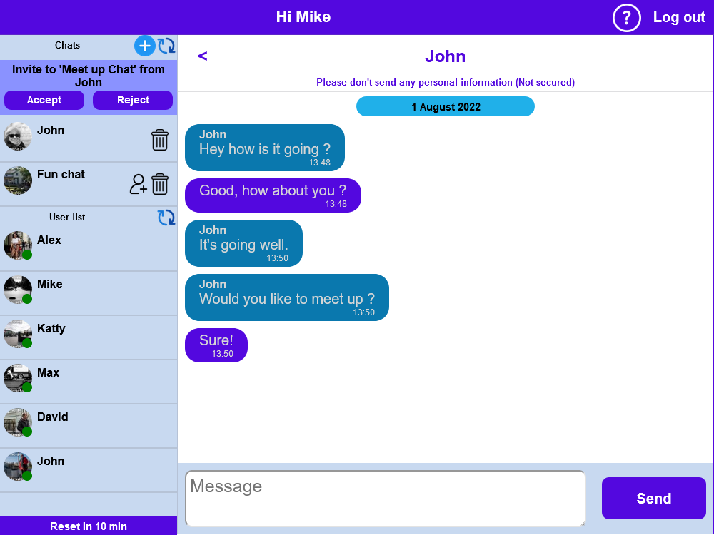

# React chat app
A project made for the purpose of learning more about react.
After spending some time on this project, I have learned a bit more about react. As I had to redesign my code a couple of times to make it work well, it has taught me to think things through before starting to code, as it would save me a lot of time during debugging. The project itself was fun to make however there was a bit of brainstorming involved with the backend. Overall, I have learned quite a bit, both react, expressJS, sass and generally the structure of code. 

## Conclusion:
Looking at the overall project after being mostly done, I can say that there are things which I would design better now. However, given that I am new to react this is pretty good progress. I will continue to improve this as time goes on, as there are a few improvements that could be done.

## Project features
- Login (No user token)
  - Used as anonymous login (no password).
  - Logout deletes user, but if user closes browser, it won't be deleted. (Making it not secure).
  
- App
  - The app user list, chat list and chat refresh every couple of seconds.
  
- User list
  - Displays profile picture (currently uses random image)
  - Username
  - Click results in creation of 1 to 1 chat with that user.
  
- Chat list
  - Displays invites and chats
  - Ability to create multi user chat with custom name (Buggy due to bad DB structure, learning right...).
  - Deleting 1 to 1 chat, removes it for both users.
  - Deleting multi user chat removes the user from that chat. (No notification message)
  - Does not notify user of new messages (Current structure of code does not easily allow for that).
  
- Chat window
  - Updates messages only for the current chat
  
- Server 
  - The server clears all messages, empty chats and sets inactivity every 30 min. (Can be easily changed to something else).
  
 ## Improvements
 - [ ] The design of this app could be more focused, as currently it is a 
 mix between anonymous chat room and general chat that remembers you.
 - [ ] The code could be simpler and more straight forward.
 
- Login
  - [ ] Could be made more secure
  - [ ] Keeping the active username unique (to prevent other people login in using existing logins)
  - [ ] Custom profile pictures or a selection to choose from, would look nice.
  
- User/chat list 
  - [x] 1 to 1 chats could be merged in to the user tile, instead of creating a separate chat.
  - [ ] New message notification for all chats not just the active one.
  
Other general improvements....
